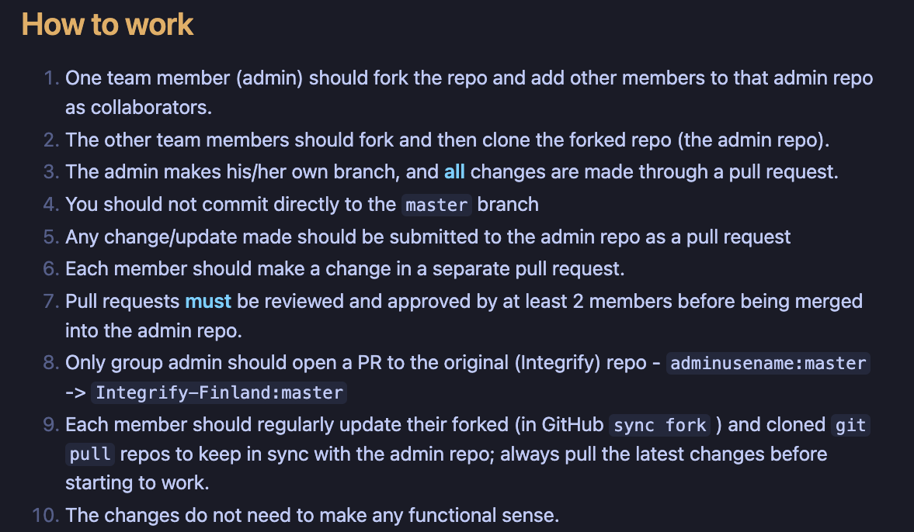

# **Assignment: Employee Management System with CRUD Operations and Pagination**

The goal of this assignment is to help students practice creating a simple CRUD API for managing employees using ASP.NET Core Minimal APIs. This project will also include pagination and basic input validation, providing a practical hands-on experience with common backend tasks.

## Steps to follow when working in a shared repo

## **Project Requirements**

1. **Entities**:

   - **Employee**: Represents an employee with the following properties:
     - `Id` (Guid) - Unique identifier for each employee.
     - `FirstName` (string) - The first name of the employee.
     - `LastName` (string) - The last name of the employee.
     - `Email` (string) - The employee's email address, which should be unique.
     - `Position` (string) - The position or job title of the employee.
     - `Salary` (decimal) - The salary of the employee.
     - `CreatedAt` (DateTime) - The date and time when the employee was created.

2. **CRUD Endpoints**:

   - **GET** `/employees`: Retrieve a list of employees with pagination support (`pageNumber` and `pageSize`).
   - **GET** `/employees/{id}`: Retrieve a specific employee by their unique `Id`.
   - **POST** `/employees`: Create a new employee.
   - **PUT** `/employees/{id}`: Update an existing employee’s details.
   - **DELETE** `/employees/{id}`: Delete an employee by their unique `Id`.

3. **Input Validation**:

   - Ensure that `FirstName`, `LastName`, and `Position` are not empty.
   - Ensure that `Email` is valid and unique.
   - Ensure that `Salary` is a positive value.

4. **Responses**:
   - Return appropriate HTTP status codes:
     - `200 OK` for successful operations.
     - `201 Created` for successfully created employees.
     - `404 Not Found` if the employee is not found.
     - `400 Bad Request` for invalid inputs.
